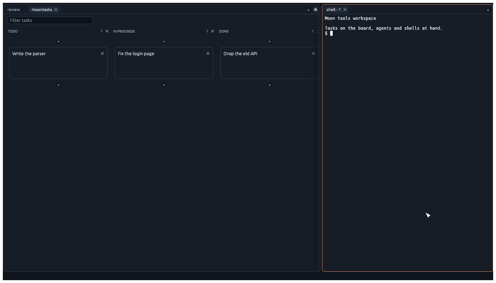
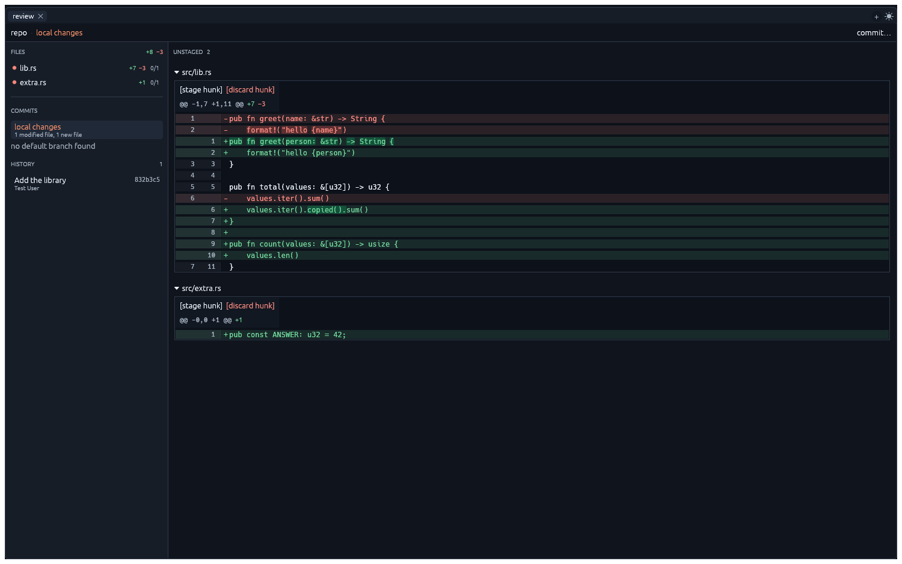

# 🌚 moon-dev-tools

A collection of local tools for the agentic era.

`moon-dev-tools` brings task planning, agent workspaces, shells and code review together. It
installs three executables:

| | |
| --- | --- |
| `moontasks` | a sprint board for organizing tasks, agents and shells |
| `moonreview` | a local code review UI for git |
| `moonshell` | a shell in the repo |



**Moontasks** is a sprint board that keeps you organized while several agents and shells work
through a repo. Each card is a task folder with notes, running shells and agents attached to it,
so agent work has a visible place instead of disappearing into terminal tabs. Open any resource
beside the board and move cards through your own workflow as work progresses.



**Moonreview** is the review frame. It shows git hunks and lets you comment, stage or unstage
them individually, then commit and push what you staged from a pane beside the review — signed
commits included, since git runs in a real terminal there and pinentry can ask for your
passphrase in it. Send comments to your local Claude, Codex or OpenCode using your signed-in
account, or collect one review to paste into another AI tool. **Moonshell** opens the same
workspace directly on a shell.

Whichever you start, the other two are a command palette away — they are frames of the same
window, not separate apps.

Moonreview has two frontends over the same local server:

- a **native window**, which carries the server inside the same executable — this is the default
- the **web frontend**, in a browser tab, which is the same review and stays fully supported

## Quick install

Install the latest prebuilt release:

```bash
curl -fsSL https://raw.githubusercontent.com/antoineMoPa/moon-dev-tools/main/install.sh | sh
```

This installs all three executables and desktop launchers. If `~/.local/bin` is not already on
your `PATH`, add it in your shell configuration.

## Build from source

Requirements:

- [Rust](https://www.rust-lang.org/tools/install)
- Node.js with npm
- [Zig](https://ziglang.org/) 0.15.x, for the native window's terminal

```bash
./scripts/setup-dev.sh           # Rust update, npm packages, Zig and submodules
export PATH="$(brew --prefix zig@0.15)/bin:$PATH"
cargo install --locked --path .   # installs moonreview, moontasks and moonshell
moonreview install-launchers      # optional: launchers the OS itself offers
moonreview
```

Source builds require Rust plus the existing Node/npm frontend toolchain used by `build.rs`.
`--locked` builds the dependency versions in `Cargo.lock`; without it `cargo install` re-resolves
to the newest compatible versions, which is how you end up compiling a release nobody tested.

The native window embeds Ghostty's terminal emulator
([libghostty-vt](https://libghostty.tip.ghostty.org/)), which is built from Ghostty's Zig
source, so a Zig 0.15.x toolchain has to be on `PATH` at build time. On macOS:

```bash
brew install zig@0.15
export PATH="$(brew --prefix zig@0.15)/bin:$PATH"
```

Everything still links statically — the result is three executables with no runtime
dependency on Zig or on a separate server process. They share one library, so the build
compiles once and links three times.

To build Moonreview's web frontend only, without the native window or Zig:

```bash
cargo install --locked --path . --no-default-features
```

## Desktop launchers

`cargo install` leaves three executables on `PATH`, which is all a shell needs. To open them
from the OS as well — Spotlight and Launchpad on macOS, the application menu on Linux:

```bash
moonreview install-launchers
```

It writes one launcher per installed executable: a `.app` bundle in `/Applications` on macOS —
in `~/Applications` instead, for an account that cannot write the shared folder — and a
`.desktop` entry in `~/.local/share/applications` on Linux. The window has the same thing in
its macOS menu bar and in the command palette, as `install desktop launchers`. Each launcher
runs the executable where it is installed, so `cargo install` over it is also an upgrade of
what the launcher opens; rerun the command only after moving the executables somewhere else.

A window opened that way starts outside every repo, so it asks which repo to open with the
folder picker of the OS.

`install.sh` writes the launchers itself, so a prebuilt install needs nothing further.

## Usage

```bash
moontasks    # the sprint board
moonreview   # review local changes
moonshell    # a shell in the repo
```

Run any of them inside a git repository. The other tools remain one command-palette action away
(`⌘⇧P`).

### Moontasks

Create a card for a piece of work, choose an agent, and Moontasks starts it in the repo. Cards
group the task brief, shared notes, agent runs and shells in one place. Drag cards and columns
to make the board match your workflow.

Task state lives in the repo's `.moontasks/` directory. See [Moontasks.md](Moontasks.md) for the
complete board behavior and controls.

### Moonreview

Pass two paths to compare arbitrary files in a read-only review:

```bash
moonreview a.txt b.txt
```

Every review target works the same in either frontend:

```bash
moonreview .              # only the current directory
moonreview src/main.rs    # only that file or directory
moonreview 4542abe        # one commit, read only
moonreview diff dev       # against a git target, read only
```

Inside the window:

| | |
| --- | --- |
| click a diff line | select it and open a comment on it |
| shift-click | extend the selection over more lines |
| `⌘⏎` | save the comment being written |
| `s` / `u` | stage / unstage the hunk under the caret |
| `⌘⇧P` | command palette — open a review, a shell, the task board, or the agent monitor |
| `⌘N` | another window of this same program, on its launch screen |
| `⌘J` | switch light and dark |
| `?` | the shortcut list |

Clicking a diff line selects it and opens a comment on it; shift-click extends the run. The
comment is anchored to exactly those lines, and `stage lines` stages exactly those lines.

On macOS the **View** menu carries "Open in Browser" and the theme switch, and the **Window**
menu opens another window of any of the three programs — `New Moontasks Window` from the
review, `New Moonreview Window` from the board. A new window opens on its launch screen, so it
is a new place to work rather than a second view of this one; `moontasks --pick` is the same
thing from a shell. Everywhere else those live in the command palette, which also has them on
macOS.

### Web frontend

`--web` opens a browser tab against a background server instead, which is how moonreview
worked before the window existed:

```bash
moonreview --web
```

The window also serves the web frontend, so **View → Open in Browser** (`⌘B`), or
`open in browser` in the command palette, opens the same review in a browser without starting
anything else.

## Settings

What belongs to you rather than to a repo or a window is kept in one file:

```
~/.moonreview/settings.json
```

Right now that is which agent Moonreview hands comments to — the selector at the top right.
Pick one and the next window comes up on it. The file is meant to be readable and editable:

```json
{
  "selected_agent": "claude"
}
```

### Working on another machine

Run the server where the repo is:

```bash
# on the remote machine
MOONREVIEW_HOST=0.0.0.0 moonreview serve
```

Then point a local window at it:

```bash
moonreview --remote dev-box --repo /home/you/project
```

`--remote` takes `host`, `host:port`, or a full URL, and defaults to port 42000. Leave
`--repo` off and the window asks which path to review. Shells opened in the window run on
the remote machine, as does everything the review does to the repo.

The task board works the same way round: `.moontasks` is the remote repo's folder and the
agents run there, so closing the window leaves them working and reopening it finds them.

The server binds `127.0.0.1` unless `MOONREVIEW_HOST` says otherwise, and it has no
authentication, so prefer an SSH tunnel over exposing the port:

```bash
ssh -N -L 42000:127.0.0.1:42000 dev-box   # then: moonreview --remote 127.0.0.1
```

## Stopping the server

Closing the native window ends the process. For the `--web` flow:

```bash
pkill moonreview
```

A standalone `serve` also times out after 30 minutes of inactivity.

## Crates

Two pieces of the native window are libraries in their own right, kept as submodules under
`crates/` and published separately:

- [**egui_frames**](crates/egui_frames) — tabs, splits and draggable panes for egui. The
  arrangement the Moon tools workspace is made of, with nothing product-specific in it.
- [**egui_tty**](crates/egui_tty) — a terminal emulator widget for egui, on Ghostty's VT engine.
  What a shell tab holds.

After cloning, pull them in:

```bash
git submodule update --init --recursive
```

## Development

I usually use this as part of my debug loop:

```bash
pkill moon;  cargo install --locked --path .
```

To install launchers:

```bash
cargo install --locked --path .; moonreview install-launchers
```

On mac you will need to drag applications from the Applications folder to your menu bar.

## Origin of the names

Moonreview started as a lunch-time project named `noon-review` by an AI tool. That was a
terrible name, so it became Moonreview: close enough to the original, more fun, and fitting for
reviewing after a long hacking day. Moontasks and Moonshell joined it later, and
`moon-dev-tools` became the home for the whole collection.
